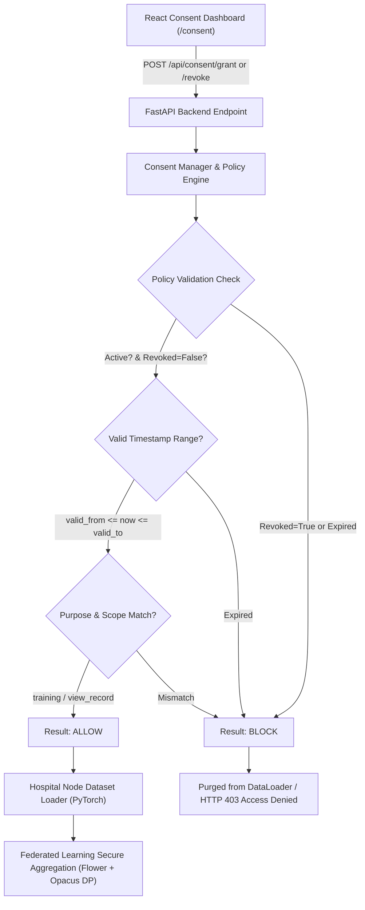

# FedABHA: Privacy-Preserving Federated Healthcare System with ABHA Identification

FedABHA is an advanced privacy-preserving federated healthcare platform integrating **ABHA (Ayushman Bharat Health Account) Identifiers**, **Zero-Trust Real-Time Consent Governance**, **Federated Learning**, and **Immutable Audit Trails**.

---

## 🚀 Quick Start & Installation Guide

### Prerequisites
Make sure you have the following installed on your system:
- **Python 3.9+**
- **Node.js (v18+) & npm**

---

### Step 1: Clone & Setup Python Backend Environment

1. Open your terminal in the project root directory:
   ```bash
   cd FedABHA
   ```

2. Create and activate a Python virtual environment:
   - **Windows (PowerShell)**:
     ```powershell
     python -m venv .venv
     .\.venv\Scripts\Activate.ps1
     ```
   - **Linux / macOS**:
     ```bash
     python3 -m venv .venv
     source .venv/bin/activate
     ```

3. Install required Python packages:
   ```bash
   pip install -r requirements.txt
   ```

---

### Step 2: Setup Frontend React Application

1. Navigate to the `frontend` directory and install dependencies:
   ```bash
   cd frontend
   npm install
   ```

---

## 🏃 Running the Application

### 1. Start the FastAPI Backend Server

From the root project directory (with `.venv` activated):
```bash
python -m uvicorn backend.main:app --reload --port 8000
```
- **API Base URL**: `http://127.0.0.1:8000`
- **Swagger API Docs**: `http://127.0.0.1:8000/docs`

---

### 2. Start the React Frontend Dashboard

In a separate terminal, navigate to the `frontend` folder and run:
```bash
cd frontend
npm run dev
```
- **Dashboard URL**: `http://localhost:5173`

---

### 3. (Optional) Run Federated Learning Server & Hospital Nodes

To execute live multi-hospital federated training across local hospital nodes (Hospital A, Hospital B, Hospital C):

- **Automated PowerShell Script (Windows)**:
  ```powershell
  .\scripts\start_fl.ps1
  ```

- **Manual Terminal Startup**:
  1. **FL Aggregator Server**:
     ```bash
     python backend/federated_learning/server.py
     ```
  2. **Hospital Node A Client**:
     ```bash
     python hospitals/hospital_A/client.py
     ```
  3. **Hospital Node B Client**:
     ```bash
     python hospitals/hospital_B/client.py
     ```
  4. **Hospital Node C Client**:
     ```bash
     python hospitals/hospital_C/client.py
     ```

---

## 💡 Key Features & System Modules

| Feature Module | Description |
| :--- | :--- |
| **Local Hospital Portal (`/local-hospital`)** | Inspect patient Electronic Health Records (EHR) via **ABHA ID** (e.g. `ABHA-1001`, `91-8881-6118-5186`), view clinical vitals, disease diagnosis flags, and trigger federated AI risk predictions. |
| **Real-Time Consent Governance (`/consent`)** | Enforces zero-trust privacy consent policies at the hospital gateway. Revoked consents (e.g. `ABHA-REVOKE-99`) are automatically blocked in real-time. |
| **Federated Learning (`/fl`)** | Multi-node model aggregation using Differential Privacy ($\epsilon$-guarantees) to train global healthcare risk prediction models without moving raw patient data. |
| **Immutable Audit Logs (`/audit`)** | Cryptographic local ledger logging all EHR access attempts, consent checks, and training round updates. |

---

## 🔒 Zero-Trust Consent Architecture Flowchart



### 📋 ABDM Patient Consent Decision Checklist

| Evaluation Step | Source Code Rule (`backend/consent/consent_validator.py`) | Decision Impact |
| :--- | :--- | :--- |
| **1. Is Consent Active?** | `if not consent.is_active` | `BLOCK` if false |
| **2. Has Consent Been Revoked?** | `if consent.is_revoked` | `BLOCK` if true |
| **3. Is Within Validity Period?** | `valid_from <= current_time <= valid_to` | `BLOCK` if expired |
| **4. Does Purpose Match?** | `requested_purpose in consent.purpose` | `BLOCK` if purpose not authorized |
| **5. Does Scope Match?** | `requested_scope in consent.scope` | `BLOCK` if data scope unauthorized |
| **Final Access Authorization** | `ConsentValidator.evaluate() == "ALLOW"` | **`ALLOW` (Record Included in Model Training)** |

---

## 🛠️ Project Architecture

```
FedABHA/
├── backend/
│   ├── api/                  # FastAPI REST endpoints (hospital, consent, FL, prediction)
│   ├── blockchain/           # Audit trail logging service (ConsentAudit.sol interface)
│   ├── consent/              # Real-time consent policy manager & enforcer
│   ├── federated_learning/   # Aggregation server & FL training pipelines
│   └── main.py               # Main API application entrypoint
├── blockchain/
│   └── contracts/            # ConsentAudit.sol Smart Contract
├── data/
│   └── hospitals/            # Local hospital node patient CSV datasets
├── frontend/                 # React + Vite + TailwindCSS Web Application
│   ├── src/
│   │   ├── pages/            # Dashboard, Local Hospital, Consent, FL, Predictions
│   │   └── services/         # API integration layer
│   └── package.json
├── hospitals/                # Federated client instances (Hospital A, B, C)
├── scripts/                  # Data partitioners & FL startup scripts
└── requirements.txt          # Python dependencies
```

